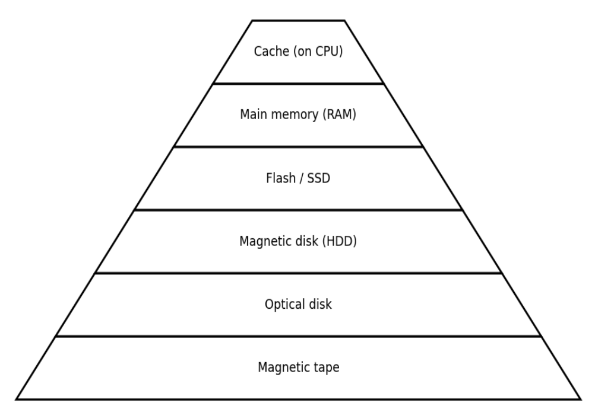

# 03. Hardware: CPU, GPU, Memory, Storage Devices

:material-account: Rahida Asadli, Ismayil Shahaliyev  
:material-calendar: Oct 25 2025 :material-calendar-edit: Jan 30, 2026

## Hardware

[_Hardware_](https://en.wikipedia.org/wiki/Computer_hardware) refers to the **physical components** of a computer system, the parts you can see and touch. It includes all electronic and mechanical elements that work together to input, process, store, and output data.

The [motherboard](https://en.wikipedia.org/wiki/Motherboard) is the main circuit board and backbone of the computer, responsible for connecting and coordinating all hardware components. It provides electrical pathways (called _buses_) and controllers that allow the _Central Processing Unit (CPU)_, memory, storage devices, input components (e.g. keyboard, mouse, microphone, scanner), and output components (e.g. monitor, printer, speaker) to communicate quickly and in the correct sequence. The motherboard ensures that data flows smoothly between these parts, much like a central highway system linking different parts of a city. The _CPU socket_ is the slot where the processor is installed; through tiny metal contacts, it connects directly to the motherboard so the CPU can fetch, decode, and execute instructions from memory. Beside it are the memory slots, where _Random-Access Memory (RAM)_ modules are inserted. RAM temporarily holds the data and instructions the CPU is currently working with, allowing fast access and efficient processing.

<figure class="w50">
  
  <figcaption>
    The motherboard of a Samsung Galaxy SII; almost all functions of the device are integrated into a very small board. By
    <a href="//commons.wikimedia.org/wiki/User:1Veertje" title="User:1Veertje">Vera de Kok</a> –
    Own work,
    <a href="https://creativecommons.org/licenses/by-sa/3.0" title="Creative Commons Attribution-Share Alike 3.0">CC BY-SA 3.0</a>,
    <a href="https://commons.wikimedia.org/w/index.php?curid=20051184">Link</a>
  </figcaption>
</figure>

!!! note
    Imagine you open the calculator app on your computer. When you click the icon, the action is sent through the motherboard. The calculator program is loaded into RAM, and the CPU begins reading its instructions from memory and carrying them out. When you type numbers, they are kept in RAM while the CPU performs the calculations. The result is then shown on the screen. If you close the app, the data in RAM is cleared, but the calculator program itself remains stored in a storage device for future use.

## Von Neumann Architecture

The [_von Neumann architecture_](https://en.wikipedia.org/wiki/Von_Neumann_architecture) (1945) describes how most computers are structured. It consists of five key components. The **input unit** receives data and instructions from external devices. The **memory unit** stores data and instructions, either temporarily during processing or permanently for long-term use. The **arithmetic logic unit** performs arithmetic operations, such as addition and subtraction, as well as logical operations. The **control unit** directs and coordinates all system activities by controlling the flow of data and instructions between components. Finally, the **output unit** presents the processed information to the user or transmits it to other systems through output devices or communication interfaces.

<figure class="w100">
  
  <figcaption>
    A von Neumann architecture scheme. By
    <a href="//commons.wikimedia.org/w/index.php?title=User:Kapooht&amp;action=edit&amp;redlink=1"
       title="User:Kapooht (page does not exist)">Kapooht</a> –
    Own work,
    <a href="https://creativecommons.org/licenses/by-sa/3.0"
       title="Creative Commons Attribution-Share Alike 3.0">CC BY-SA 3.0</a>,
    <a href="https://commons.wikimedia.org/w/index.php?curid=25789639">Link</a>
  </figcaption>
</figure>

Both **data** and **instructions** are stored together in the same memory. This is called the _stored-program concept_. It was important because it allowed computers to keep programs in memory along with the data they use. This made it possible to change or run different programs by loading new instructions into memory, instead of manually changing the computer’s hardware connections. It simplified computer design, enabled automation of complex tasks, and made programming far more flexible.

It is common sense to us now, but only because it became the foundation of modern computing. Before the stored-program concept, computers like [ENIAC](https://en.wikipedia.org/wiki/ENIAC) had to be rewired by hand for every new task. There was no “program” to load—the hardware was the program. [John von Neumann](https://en.wikipedia.org/wiki/John_von_Neumann)’s idea separated hardware (the machine) from software (the instructions it runs) and treated code as just another form of data. That shift made general-purpose computers possible.

!!! note
    When you use a calculator app to add two numbers, both the program’s instructions (load number, add, display result) and the numbers you enter are stored in RAM. The CPU retrieves and executes the instructions one by one, reads the data from memory, performs the addition, and writes the result back, following the stored-program model.

## Central Processing Unit

[Central Processing Unit (CPU)](https://en.wikipedia.org/wiki/Central_processing_unit) follows program instructions and performs the steps needed to complete tasks, from typing a word to playing music. The CPU also controls and coordinates the work of other parts of the computer, making sure everything happens in the right order. It has three main components.

<figure class="w50 float-left">
  
  <figcaption>
    A high-end consumer CPU made by Intel: an
    <a href="https://en.wikipedia.org/wiki/List_of_Intel_Core_processors">Intel Core i9-14900KF</a>.
    By <a href="//commons.wikimedia.org/wiki/User:Pstrahl" title="User:Pstrahl">Pstrahl</a> –
    Own work,
    <a href="https://creativecommons.org/licenses/by-sa/4.0"
       title="Creative Commons Attribution-Share Alike 4.0">CC BY-SA 4.0</a>,
    <a href="https://commons.wikimedia.org/w/index.php?curid=151972144">Link</a>
  </figcaption>
</figure>

[Control Unit (CU)](https://en.wikipedia.org/wiki/Control_unit) manages and directs activities inside the CPU. It tells the computer when to fetch data, when to carry out an instruction, and where to send results. You can think of it as the traffic controller of the CPU.

[Arithmetic Logic Unit (ALU)](https://en.wikipedia.org/wiki/Arithmetic_logic_unit) performs arithmetic operations (addition, subtraction, multiplication, division) and logical operations (comparisons such as equal to, greater than, AND, OR, NOT). When the CPU executes an instruction like `add 2 + 3`, the CU sends the task to the ALU. The ALU performs the calculation and sends the result back to registers or memory.

[Registers](https://en.wikipedia.org/wiki/Processor_register) are tiny, high-speed memory locations built directly into the CPU. They store data and instructions temporarily during processing. Because they are inside the CPU, registers are much faster than RAM. Examples include:

- Instruction Register (IR) holds the current instruction being executed.
- Program Counter (PC) keeps track of the next instruction’s address in memory.
- Accumulator (ACC) stores intermediate arithmetic and logic results.

Every action the CPU performs follows four main steps, known as the [machine cycle](https://en.wikipedia.org/wiki/Instruction_cycle):

- **Fetch.** CPU gets an instruction from RAM.
- **Decode.** CPU determines what the instruction means.
- **Execute.** CPU carries out the action (the ALU does the work).
- **Store.** CPU saves the result back to memory or sends it to an output device.

This process (`fetch → decode → execute → store`) repeats continuously, millions or billions of times per second.

!!! note
    When a computer adds two numbers, several CPU components work together. First, the CU fetches the instruction from main memory (the binary code telling the CPU what to do). Then it decodes the instruction and identifies which data to use. After decoding, the CU sends control signals that tell the ALU to perform the operation and tell the registers when to load or output data.
    
    The ALU receives the numbers from registers, performs the addition in binary, and produces the result. Registers act as extremely fast storage locations: before the ALU starts, the inputs are placed in registers; after the ALU finishes, the output is stored in a register, ready to be written back to memory or used by the next instruction.
    
    Throughout the process, the CU enforces timing and order, ensuring that data moves only when it should. This coordination—fetching, decoding, executing, and storing—is what allows simple operations to happen reliably at very high speed.

The **clock** is the timing system of the CPU. It sends out a steady stream of electrical pulses that set the pace for operations. The _clock speed_ indicates how many cycles occur per second and is measured in Hertz (Hz). For example, a CPU with a 3.0 GHz clock runs about 3 billion cycles per second.

**Word size** is the number of bits the CPU can process in one operation. The most common sizes are _32-bit_ and _64-bit_. A 64-bit CPU can handle larger data chunks and can address much more memory than a 32-bit CPU.

Modern CPUs contain multiple **cores**, meaning multiple processing units inside a single chip. Each core can run instructions independently, allowing parallel processing. A dual-core CPU can run two heavy tasks at once (for example, encoding a video while running a game), while lighter tasks can be managed by [time-sharing](https://en.wikipedia.org/wiki/Time-sharing) even on a single core.

**Instruction Set Architecture (ISA)** is the built-in language of the CPU. It defines the commands the CPU can understand and execute. The ISA specifies what operations exist and how programs interact with memory and hardware, while the [microarchitecture](https://en.wikipedia.org/wiki/Microarchitecture) describes how a particular CPU implements and executes those instructions internally. Common examples include x86/x86-64 (Intel, AMD) and ARM (mobile devices and many modern laptops).

!!! note
    An Intel CPU executes x86 instructions, while many smartphone CPUs execute ARM instructions. Programs must be compiled for the correct instruction set so the CPU can run them.

## Graphics Processing Unit

While the CPU is responsible for general-purpose computation and overall control, modern computers also rely on the [Graphics Processing Unit (GPU)](https://en.wikipedia.org/wiki/Graphics_processing_unit). A GPU is a specialized processor designed to perform a very large number of simple calculations in [parallel](https://en.wikipedia.org/wiki/Parallel_computing). Originally, GPUs were built for graphics workloads such as rendering 3D scenes and updating frames smoothly in games and graphical applications.

Unlike the CPU, which has a small number of powerful cores optimized for sequential work, a GPU contains thousands of simpler cores optimized for parallel operations. This makes GPUs efficient at tasks where the same computation must be applied to many data elements at once, such as pixels, vertices, or vectors.

Today, GPUs are widely used beyond graphics, including scientific computing, simulations, video processing, and [artificial intelligence](../09_ai), where large matrix and vector operations are common. In typical workloads, the CPU manages control flow and coordination, while the GPU performs heavy numerical computation.

## Memory Devices

Every computer must store data and instructions so the CPU can use them. The place where this information is kept is called memory. Different kinds of memory serve different purposes—some are very fast but _volatile_ (temporary), while others are slower but _non-volatile_ (persistent). Volatile memory loses its contents when power is removed; non-volatile memory does not.

A common classification is:

- **Primary storage.** Volatile storage used directly by the CPU (registers, cache, RAM).
- **Secondary storage.** Non-volatile persistent storage (SSD, HDD) that must be loaded into primary memory before use.
- **Tertiary storage.** Non-volatile, much slower storage used for backups and archives, often accessed sequentially (optical discs[^1], magnetic tapes).

### Primary Storage

[RAM (Random Access Memory)](https://en.wikipedia.org/wiki/Random-access_memory) is the main working memory. It temporarily stores data and instructions the CPU is currently using. RAM is volatile and has two common types: Dynamic RAM (DRAM) and Static RAM (SRAM).

- **DRAM** stores each bit in a tiny [capacitor](https://en.wikipedia.org/wiki/Capacitor). Because capacitors leak charge, DRAM must be refreshed continuously. DRAM is cheaper and higher capacity, but slower than SRAM. It serves as the computer’s main memory.
- **SRAM** uses [flip-flop circuits](https://en.wikipedia.org/wiki/Flip-flop_%28electronics%29) that keep data stable while power is on, without refreshing. SRAM is faster but larger and more expensive.

**Cache memory** is a very small, ultra-fast SRAM built into the CPU. It stores frequently used data and instructions so the CPU does not repeatedly fetch them from slower RAM. _L1 cache_ is the smallest and fastest (per core). _L2 cache_ is larger and slower. _L3 cache_ is larger still and often shared across cores.

!!! note
    Imagine you have several browser tabs open. The content and program state for those tabs are stored in DRAM so the CPU can access them while you work. If power is removed, those in-memory states disappear.
    
    At the same time, the CPU uses much smaller but faster SRAM cache for the most frequently used instructions and data. When the same parts of a webpage or video are accessed repeatedly, cache reduces the time spent waiting on DRAM, improving responsiveness.

**Read-Only Memory (ROM)**[^2] is non-volatile memory that retains data when power is off. During startup, the CPU reads firmware from ROM—commonly [BIOS](https://en.wikipedia.org/wiki/BIOS) or [UEFI](https://en.wikipedia.org/wiki/UEFI)—which checks hardware and then loads the [operating system](https://en.wikipedia.org/wiki/Operating_system) into RAM. ROM is typically programmed by the manufacturer, although modern forms like [EEPROM](https://en.wikipedia.org/wiki/EEPROM) can be updated electronically.

### Secondary Storage

Storage devices use two main retrieval methods: [sequential access](https://en.wikipedia.org/wiki/Sequential_access) and [direct (random) access](https://en.wikipedia.org/wiki/Random_access). In sequential access, data is read in order until the desired location is reached. In random access, the device can jump directly to a location.

**Hard Disk Drive (HDD)** stores data on spinning magnetic platters, commonly 5,400–7,200 RPM. Data is read and written by a moving head. HDDs provide large capacity at low cost, but are slower due to mechanical movement and more vulnerable to shock. HDDs support random access.

**Solid State Drive (SSD)** stores data in [flash memory](https://en.wikipedia.org/wiki/Flash_memory) and has no moving parts, making it much faster and more reliable than HDDs. SSDs offer fast boot times, quick application loading, and low-latency file access. Their cost per gigabyte is typically higher than HDDs.

<figure class="w80 float-left">
  
  <figcaption>
    Storage hierarchy pyramid (created with
    <a href="https://matplotlib.org/">matplotlib</a>).
  </figcaption>
</figure>

To summarize, the storage hierarchy organizes memory and storage by speed, cost per bit, and capacity. At the top, registers and cache are the fastest but smallest and most expensive per bit. RAM is next: slower than cache, larger, and still volatile. Below RAM, SSDs provide persistent storage with low latency. HDDs provide larger capacity at lower cost but with slower access times. Optical discs and magnetic tape sit lower in the hierarchy: they are cheaper per bit and good for distribution or archival storage, but much slower, especially for random access. Moving upward increases speed and cost per bit while reducing capacity; moving downward increases capacity and lowers cost per bit while increasing access time.

## Additional Material

- [How do Transistors Build into a CPU? How do Transistors Work?](https://www.youtube.com/watch?v=_Pqfjer8-O4)
- [How do Hard Disk Drives Work?](https://www.youtube.com/watch?v=wtdnatmVdIg)
- [How does Computer Memory Work?](https://www.youtube.com/watch?v=7J7X7aZvMXQ)
- [How Computers Calculate - the ALU: Crash Course Computer Science #5](https://www.youtube.com/watch?v=1I5ZMmrOfnA)
- [How a CPU Works in 100 Seconds](https://www.youtube.com/watch?v=vqs_0W-MSB0)
- [Von Neumann Architecture - Computerphile](https://www.youtube.com/watch?v=Ml3-kVYLNr8)
- [How do Graphics Cards Work? Exploring GPU Architecture](https://www.youtube.com/embed/h9Z4oGN89MU)

[^1]: *Disk* is standard in computer science for magnetic and solid-state storage (hard disk, disk drive). *Disc* is used for optical media (CD/DVD/Blu-ray discs).

[^2]: ROM is not used as working memory and is best treated separately from primary/secondary/tertiary storage. It stores non-volatile firmware used mainly during system startup rather than data and instructions actively processed by the CPU.
