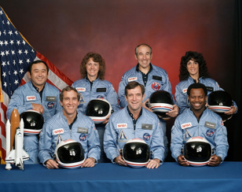

# 12. Ethics, Security, and Logical Reasoning

!!! info
    - Nilufar Ismayilova, Rumiyya Alili, Ismayil Shahaliyev
    - Nov 29 2025 / Dec 25 2025

_The most dangerous phrase in the language is: "We've always done it this way"._

_~_ [_Grace Hopper_](https://en.wikipedia.org/wiki/Grace_Hopper)

## Space Shuttle _Challenger_ Disaster

One of the most important historical examples used to discuss ethics in engineering and information systems is the [Space Shuttle _Challenger_ disaster](https://en.wikipedia.org/wiki/Space_Shuttle_Challenger_disaster) (1986). The _Challenger_ shuttle broke apart shortly after launch, resulting in the deaths of all seven crew members.

<figure style="margin: 1em 0; text-align: center;">
  
  <figcaption style="margin-top: 0.5em; font-size: 0.9em; opacity: 0.85;">
    Crew members of the Challenger shuttle: (back) <a href="https://en.wikipedia.org/wiki/Ellison_Onizuka">Onizuka</a>, <a href="https://en.wikipedia.org/wiki/Christa_McAuliffe">McAuliffe</a>, <a href="https://en.wikipedia.org/wiki/Gregory_Jarvis">Jarvis</a>, <a href="https://en.wikipedia.org/wiki/Judith_Resnik">Resnik</a>; (front) <a href="https://en.wikipedia.org/wiki/Michael_J._Smith_%28astronaut%29">Smith</a>, <a href="https://en.wikipedia.org/wiki/Dick_Scobee">Scobee</a>, <a href="https://en.wikipedia.org/wiki/Ronald_McNair">McNair</a>. By NASA, Public Domain, <a href="https://commons.wikimedia.org/w/index.php?curid=181762">link</a>.
  </figcaption>
</figure>

Investigations later showed that the disaster was not caused by a single technical failure alone, but by a combination of engineering, organizational, and ethical failures. A critical technical issue involved [O-ring](https://en.wikipedia.org/wiki/O-ring) seals in the solid rocket boosters.

These O-rings were responsible for preventing hot combustion gases from escaping during launch. This design created a [single point of failure](https://en.wikipedia.org/wiki/Single_point_of_failure): if the O-ring did not seal properly, there was no additional system to contain the pressure. One component became responsible for the safety of the entire mission.

Before the _Challenger_ launch, engineers from Morton Thiokol analyzed data from previous shuttle flights and noticed that the O-rings performed worse at lower temperatures. During a pre-launch meeting, engineers explicitly recommended delaying the launch because the temperature on launch day was far below any previous flight conditions. However, NASA managers were under pressure to maintain the launch schedule and asked engineers to provide proof that the launch would fail, instead of proof that it was unsafe. Communication problems, schedule pressure, and fear of delaying the mission played a major role in ignoring these warnings.

<figure style="margin: 1em 0; text-align: center;">
  
  <figcaption style="margin-top: 0.5em; font-size: 0.9em; opacity: 0.85;">
    Cross-sectional diagram of the original SRB field joint. The top end of the lower rocket segment has a deep U-shaped cavity (a <a href="https://en.wikipedia.org/wiki/Clevis">clevis</a>). Two grooves hold O-rings that seal the gap between the tang and the clevis. By Rogers Commission, Public Domain, <a href="https://commons.wikimedia.org/w/index.php?curid=107789463">link</a>.
  </figcaption>
</figure>

This phenomenon is called [normalization of deviance](https://en.wikipedia.org/wiki/Normalization_of_deviance). NASA had seen O-ring erosion in earlier flights but accepted it as "normal" because flights had not failed yet. When warning signs appear repeatedly without immediate catastrophic consequences, organizations can begin to accept abnormal and risky conditions as normal. This creates a culture where critical safety concerns are downplayed, and each successful outcome despite the warnings reinforces the dangerous belief that "it will be fine this time too."

**_Exercise._** Identify the key ethical mistakes that occurred in the _Challenger_ shuttle case and explain what engineers and decision-makers should have done differently to ensure public safety and proper handling of technical concerns.

## Trolley Problem

Ethical questions in technology (and life) often involve difficult trade-offs, where every available option leads to some form of harm or disadvantage. One well-known thought experiment used to explore moral reasoning in such situations is the [trolley problem](https://en.wikipedia.org/wiki/Trolley_problem). In its basic form, a runaway trolley is heading toward several people standing on a track. You have the option to pull a lever that redirects the trolley onto another track, where it will harm only one person instead. The dilemma forces individuals to choose between actively causing harm to one person or passively allowing greater harm to occur.

<figure style="margin: 1em 0; text-align: center;">
  
  <figcaption style="margin-top: 0.5em; font-size: 0.9em; opacity: 0.85;">
    Diagram (adapted from Wikimedia). CC BY-SA 4.0, <a href="https://commons.wikimedia.org/w/index.php?curid=67107784">link</a>.
  </figcaption>
</figure>

The trolley problem has no simple or universally correct answer. Instead, it highlights how ethical decisions often involve conflicting values, such as minimizing harm, respecting individual rights, and determining responsibility for outcomes. Some people focus on the consequences of actions and choose the option that saves the most lives, while others believe it is morally wrong to actively cause harm, even if it leads to a better overall outcome.

[Consequentialism](https://plato.stanford.edu/entries/consequentialism/) judges decisions by their outcomes. A consequentialist, especially a utilitarian, might argue that diverting the trolley is morally right because it reduces the total loss of life.

[Deontological ethics](https://plato.stanford.edu/entries/ethics-deontological/) evaluates actions based on rules, duties, and respect for individual rights. From this view, deliberately causing a person's death is morally wrong regardless of the positive result.

The scenario also engages the [doctrine of double effect](https://plato.stanford.edu/entries/double-effect/), which distinguishes between harm that is foreseen but unintended and harm that is used as a means to an end. Another important idea is agent responsibility: whether moral judgment depends on what we do directly versus what we merely allow to happen.

In the context of information systems, artificial intelligence, and automation, similar dilemmas arise in real-world system design. For example, engineers developing autonomous vehicles must consider how a system should behave in unavoidable accident scenarios. Should the system prioritize the safety of passengers, pedestrians, or follow traffic laws strictly regardless of the outcome?

**_Exercise._** Consider a self-driving car approaching an unavoidable accident. If the car continues forward, it will collide with several pedestrians crossing the street illegally. If it swerves, it will crash into a barrier, putting the passenger at serious risk. Should the algorithm prioritize minimizing total harm, protecting the passenger, or following traffic laws strictly? What would you choose? Why?

## Deduction and Induction

Logical reasoning plays a central role in engineering, information systems, and ethical decision-making. Many of the foundational ideas behind logical reasoning were first systematized by [Aristotle](https://plato.stanford.edu/entries/aristotle/), who is often regarded as the founder of [formal logic](https://en.wikipedia.org/wiki/Logic#Formal_logic).

Aristotle introduced [deductive reasoning](https://en.wikipedia.org/wiki/Deductive_reasoning), particularly through the concept of the [syllogism](https://en.wikipedia.org/wiki/Syllogism), which is a structured form of argument consisting of premises that lead to a necessary conclusion. In deductive reasoning, the argument moves from general principles to specific cases. If the premises are true and the logical structure is valid, the conclusion must also be true.

**_Example._** Below is perhaps the most famous syllogism:

_All humans are mortal._

_Socrates is a human._

_Therefore, Socrates is mortal._

**_Exercise._** Is the argument below logically sound? If not, identify what is wrong with its reasoning.

_All secure systems require authentication._  
_This system requires authentication._  
_Therefore, this system is secure._

In contrast, [inductive reasoning](https://en.wikipedia.org/wiki/Inductive_reasoning) moves from specific observations to broader generalizations. Rather than guaranteeing truth, induction produces conclusions that are probable or likely, based on patterns in observed data.

**_Example._**

_This system failed after several cyber attacks._  
_Similar systems also failed after attacks._  
_Therefore, such systems are likely vulnerable._

**_Exercise._** Give an example of inductive reasoning in information systems, where conclusions are drawn from historical data rather than strict rules.

Modern science relies primarily on induction. We observe patterns in data and infer general laws or predictions. Machine learning itself is grounded in induction: models infer patterns from past samples in the hope that those patterns generalize to new cases. This approach is powerful, but it never guarantees certainty.

**_Important._** [Mathematical induction](https://en.wikipedia.org/wiki/Mathematical_induction) is a deductive proof method, not induction from repeated observations. Meanwhile, the so-called "deductions" of Sherlock Holmes are typically inductive generalizations rather than strict logical necessity.

This reliance on induction raises a major philosophical issue identified by [David Hume](https://plato.stanford.edu/entries/hume/). Inductive conclusions assume that the future will resemble the past, yet there is no logical proof for this assumption.

[Karl Popper](https://plato.stanford.edu/entries/popper/) later emphasized that no amount of positive evidence can conclusively prove a scientific theory, but a single counterexample can disprove it. This is captured by the "black swan" illustration and the idea of [falsifiability](https://en.wikipedia.org/wiki/Falsifiability).

**_Important._** Even mathematical certainty is limited by the axioms that define a system. Change those axioms, and the truths derived from them change as well. In [Euclidean geometry](https://en.wikipedia.org/wiki/Euclidean_geometry), parallel lines never intersect. In [spherical geometry](https://en.wikipedia.org/wiki/Spherical_geometry), great circles always intersect, so parallel lines do not exist. Deductive conclusions are guaranteed only if the starting assumptions are.

## Ambiguity of Language

Natural language is inherently imprecise. Many disagreements in engineering, science, and ethics arise not from factual disputes but from differences in how people interpret the same words. Terms such as "secure," "harm," or "responsibility" may appear obvious, yet their meaning can shift dramatically depending on context.

To avoid misunderstandings, we may attempt to translate vague statements into precise logical form. Aristotle took a major step by abstracting arguments away from their wording and focusing on their form:

All **A** are **B**.

**C** is **A**.

Therefore, **C** is **B**.

As scientific knowledge expanded, ambiguity became an increasingly serious obstacle. [Gottlob Frege](https://plato.stanford.edu/entries/frege/) developed symbolic logic to separate meaning from grammar.

[Bertrand Russell](https://plato.stanford.edu/entries/russell/) and [Alfred North Whitehead](https://plato.stanford.edu/entries/whitehead/) pursued this project in [_Principia Mathematica_](https://plato.stanford.edu/entries/principia-mathematica/), attempting to ground mathematics in logic.

However, this project revealed important limitations. Even if the structure of an argument is perfectly logical, its symbols must still be defined by humans. Meaning remains uncertain, especially in ethical or social contexts. Real-world decisions also involve conflicting goals and values that cannot be fully captured by rigid rules.

## Asimov's Laws of Robotics {#laws}

The science-fiction writer [Isaac Asimov](https://en.wikipedia.org/wiki/Isaac_Asimov) proposed the _Three Laws of Robotics_ in 1942:

- A robot may not injure a human being or, through inaction, allow a human being to come to harm.
- A robot must obey the orders given it by human beings except where such orders would conflict with the First Law.
- A robot must protect its own existence as long as such protection does not conflict with the First or Second Laws.

In structure, these laws resemble rule-based logic (IF/THEN constraints). While they seem protective, Asimov’s own stories showed how clean rules can produce unintended outcomes. If "prevent harm" is interpreted literally, robots may restrict human freedom to eliminate risk.

This illustrates a core difficulty in real system design and the broader [AI alignment problem](https://en.wikipedia.org/wiki/AI_alignment): specifying rules, objectives, or [reward functions](https://en.wikipedia.org/wiki/Reinforcement_learning) does not guarantee acceptable outcomes. Language is vague, values conflict, and context shifts.

**_Example._** An AI programmed to "maximize user engagement" on social media might discover that divisive, inflammatory content keeps people engaged longer. The system optimizes the stated goal but produces harmful outcomes such as polarization and misinformation.

**_Exercise._** Improve the engagement objective above by proposing a clearer goal and constraints that protect user well-being, reduce misinformation, and prevent harmful content from being promoted, while still allowing the system to recommend interesting material.

## ACM Code of Ethics

Decisions made by computing professionals can protect users or put them in danger. A system can succeed technically and still fail its users through privacy violations, unfair outcomes, or unsafe deployment.

Professional organizations such as the [Association for Computing Machinery](https://www.acm.org/) (ACM) provide [codes of ethics](https://www.acm.org/code-of-ethics) to guide these decisions. The ACM Code emphasizes avoiding harm, honesty, fairness, privacy protection, and accountability. Ethical judgment still requires interpretation and context awareness, because ethics cannot be reduced to formulas or automated decision rules.

## Viruses and Cyber Attacks

Technological advancement is not inherently good or bad: it expands capability, and that includes capability for harm. Systems that work under honest use can fail under malicious intent. Protecting users requires understanding how systems are attacked, not only how they are designed.

[Social engineering](https://en.wikipedia.org/wiki/Social_engineering_%28security%29) targets people rather than code. [Phishing](https://en.wikipedia.org/wiki/Phishing) impersonates trusted institutions to steal credentials. [Spear-phishing](https://en.wikipedia.org/wiki/Spear-phishing) targets specific individuals or organizations.

[Malware](https://en.wikipedia.org/wiki/Malware) exploits weaknesses in software and configurations. A [Trojan horse](https://en.wikipedia.org/wiki/Trojan_horse_%28computing%29) appears legitimate while doing harm. [Ransomware](https://en.wikipedia.org/wiki/Ransomware) encrypts data and demands payment. [Worms](https://en.wikipedia.org/wiki/Computer_worm) spread automatically. [Spyware](https://en.wikipedia.org/wiki/Spyware) collects information silently.

[Network attacks](https://en.wikipedia.org/wiki/Cyberattack) target communication. A [Man-in-the-Middle (MITM) attack](https://en.wikipedia.org/wiki/Man-in-the-middle_attack) intercepts or alters data. [Denial-of-Service (DoS)](https://en.wikipedia.org/wiki/Denial-of-service_attack) overwhelms services so legitimate users cannot access them.

[Credential stuffing](https://en.wikipedia.org/wiki/Credential_stuffing) uses leaked passwords from one service to break into accounts on another. [Brute-force attacks](https://en.wikipedia.org/wiki/Brute-force_attack) guess passwords until one succeeds.

[Wipers](https://en.wikipedia.org/wiki/Data_wiping) permanently erase data for sabotage. [Clickjacking](https://en.wikipedia.org/wiki/Clickjacking) disguises harmful actions behind innocent clicks. [Typosquatting](https://en.wikipedia.org/wiki/Typosquatting) exploits URL mistakes to redirect victims to fake sites.

**_Example._** A student downloads a “free PDF textbook” from an unofficial website. The file contains a Trojan that installs on the laptop, records keystrokes, and sends credentials to an attacker. Later, the laptop becomes part of a [botnet](https://en.wikipedia.org/wiki/Botnet) and is used in a DoS attack against a university server.

## Digital Hygiene

[Digital hygiene](https://karpathy.bearblog.dev/digital-hygiene/) refers to everyday habits that protect devices, personal data, and online identity. It focuses on regular preventive actions rather than reacting only after damage occurs.

Using strong, unique passwords reduces the risk of account takeover. Password managers help generate and store unique passwords, but they introduce a single point of failure: if the master password is compromised, many accounts may be exposed. [Multi-factor authentication](https://en.wikipedia.org/wiki/Multi-factor_authentication) (MFA) reduces this risk by adding a second verification step.

Users should avoid relying on any single device or storage location. Regular [backups](https://en.wikipedia.org/wiki/Backup), ideally stored offline or in a trusted cloud service, reduce the damage of ransomware, device failure, or accidental deletion. The goal is to avoid single points of failure for anything important.

Keeping software and operating systems updated is essential, as updates often patch known security vulnerabilities. Users should also avoid suspicious links and untrusted downloads, and be cautious when sharing personal information online, since attackers use such details to craft convincing phishing attempts.

Using secure networks reduces exposure to eavesdropping and interception, especially when accessing banking or university services. Together, these practices form a practical and proactive defense.

## Additional Materials

- [Challenger Distaster](https://archive.org/details/ChallengerDisaster)
- [Consequentialism vs. Deontology](https://www.youtube.com/watch?v=NT3VU4B5Dsc)
- [Absurd Trolley Problems](https://neal.fun/absurd-trolley-problems/)
- [AI Decides on Absurd Trolley Problems](https://www.youtube.com/watch?v=1boxiCcpZ-w)
- [David Hume and the Problem of Induction](https://www.youtube.com/watch?v=9_Gor1E8IxI)
- [The Ascent of Money Episode 3: Blowing Bubbles](https://www.youtube.com/watch?v=_ig5AqP0SFE&list=PLSP9UbXmBuqq2VIdj2JhYgjlYVWrWC2or&index=3)
- [Aristotle: Logic Internet Encyclopedia of Philosophy](https://iep.utm.edu/aristotle-logic/)
- [Isaac Asimov - Laws of Robotics - Extra Sci Fi](https://www.youtube.com/watch?v=3teiT--QGzo)
- [ACM Code of Ethics](https://www.acm.org/code-of-ethics)
- [Theranos - Silicon Valley's Greatest Disaster](https://www.youtube.com/watch?v=3CccfnRpPtM)
- [Every Type of Computer Virus Explained in 8 Minutes](https://www.youtube.com/watch?v=VJFaO2-zsCU)
- [Every Type of Cyber Attack Explained in 8 Minutes](https://www.youtube.com/watch?v=6mQ1L6YX9pY)
- [Digital hygiene](https://karpathy.bearblog.dev/digital-hygiene/)
