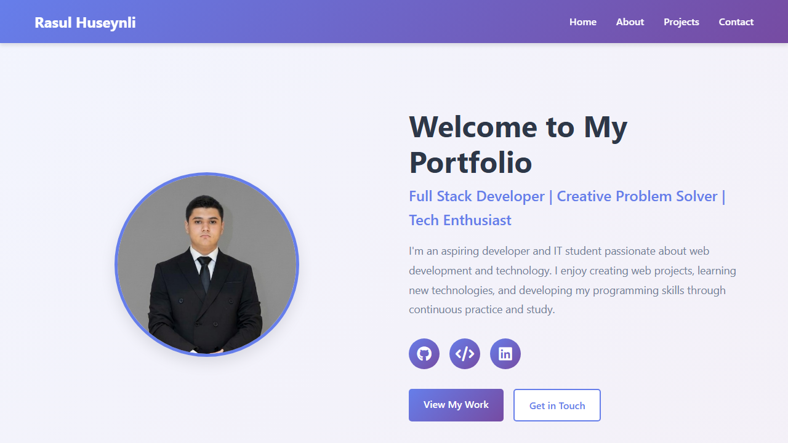
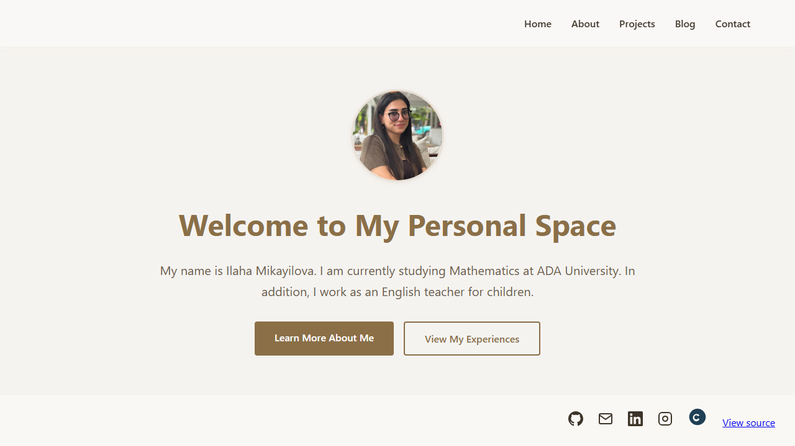
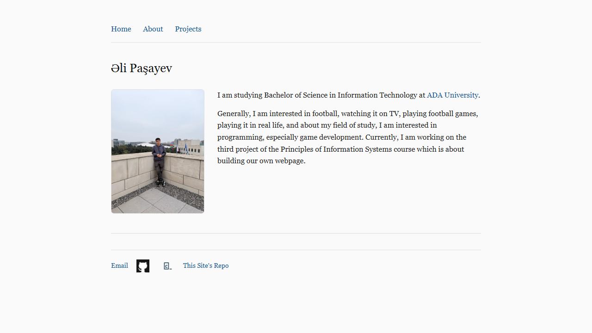

# Project 4

In this SITE 1101 individual project, students build a personal portfolio website and publish it online. Below are some of the submissions by students.

  <article class="team-card">
    

      
    

    

      

        Asli Kazimli
      

      
Fall 2025

    

  </article>

  <article class="team-card">
    

      
    

    

      

        Rasul Huseynli
      

      
Fall 2025

    

  </article>

  <!--
  <article class="team-card">
    

      
    

    

      

        Ilaha Mikayilova
      

      
Fall 2025

    

  </article>
  -->

  <article class="team-card">
    

      
    

    

      

        Ali Pashayev
      

      
Fall 2025

    

  </article>

